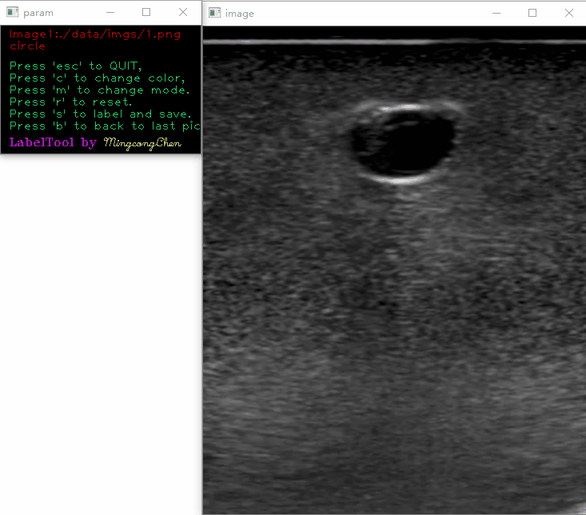

# LabelTool
  

---
**AUTHOR:** Mingcong Chen\
**CONTACT:** mingcong.chen@ia.ac.cn\
**WEBSITE:** https://mingcongchen.netlify.app/

**CASIA SKL-MCCS**
---
Fast label tool based on random walk.
## Installation
```bash
pip install opencv-python==4.1.2.30
# if in China, download is slow
pip install -i https://pypi.tuna.tsinghua.edu.cn/simple opencv-python==4.1.2.30
# if use python
pip install scipy==1.6.2     
pip install numpy==1.20.1
# if use conda 
conda install scipy==1.6.2      
conda install numpy==1.20.1
```
## Usage
Copy the image need to label to ./data/imgs then run the code by
```python
python labeltool.py
```
Press \'esc\' to QUIT

Press \'c\' to change color

'Press \'m\' to change mode.

Press \'s\' to label and save

Press \'r\' to reset

Press \'b\' to back to last pic

